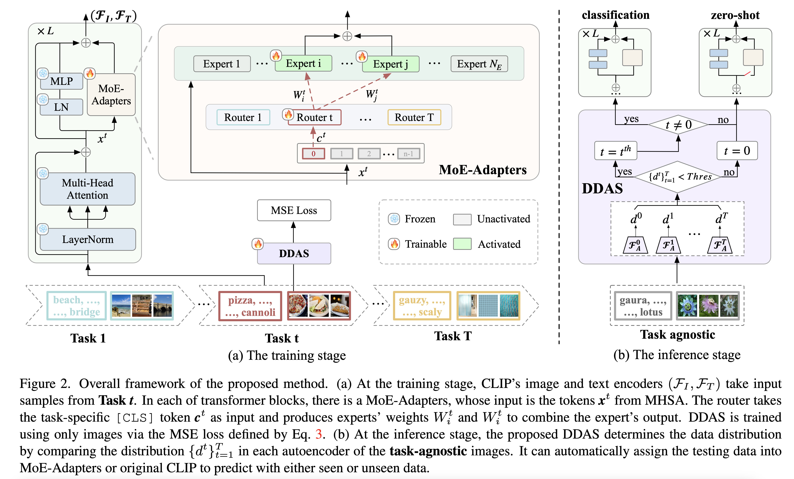

# MoE-Adapters4CL
Code for paper "[**Boosting Continual Learning of Vision-Language Models via Mixture-of-Experts Adapters**](https://arxiv.org/abs/2403.11549)" CVPR2024

## Table of Contents
  - [Abstract](#Abstract)
  - [Approach](#Approach)
  - [Install](#Install)
  - [Data preparation](#Data-preparation)
  - [Getting Started](#getting-started)
    - [Model ckpt](#Model-ckpt)
    - [MTCL](#MTCL)
      - [Test](#Test)
      - [Train](#Train)
    - [CIL](#CIL)
      - [Train](#Train)
  - [Citation](#Citation)
  - [Acknowledgement](#Acknowledgement)

## Abstract
Continual learning can empower vision-language models to continuously acquire new knowledge, without the need for access to the entire historical dataset. However, mitigating the performance degradation in large-scale models is non-trivial due to (i) parameter shifts throughout lifelong learning and (ii) significant computational burdens associated with full-model tuning. In this work, we present a parameter-efficient continual learning framework to alleviate long-term forgetting in incremental learning with vision-language models. Our approach involves the dynamic expansion of a pre-trained CLIP model, through the integration of Mixture-of-Experts (MoE) adapters in response to new tasks. To preserve the zero-shot recognition capability of vision-language models, we further introduce a Distribution Discriminative Auto-Selector (DDAS) that automatically routes in-distribution and out-of-distribution inputs to the MoE Adapter and the original CLIP, respectively. Through extensive experiments across various settings, our proposed method consistently outperforms previous state-of-the-art approaches while concurrently reducing parameter training burdens by 60%. 
## Approach
___



## Install
```bash
conda create -n MoE_Adapters4CL python=3.9
conda activate MoE_Adapters4CL
conda install pytorch==2.1.0 torchvision==0.16.0 torchaudio==2.1.0 pytorch-cuda=11.8 -c pytorch -c nvidia
cd cil
pip install -r requirements.txt
```

## Data preparation
Target Datasets: Aircraft, Caltech101,CIFAR10, CIFAR100, DTD, EuroSAT, Flowers, Food, MNIST, OxfordPet,StanfordCars, SUN397, TinyImagenet

More details can refer to [datasets.md](mtil%2Fdatasets.md) of [ZSCL](https://github.com/Thunderbeee/ZSCL). Big thanks to them for their awesome work!
## Model ckpt
|                  | Model                                                                | Link |
|------------------|----------------------------------------------------------------------|---------------------------------------------------------------------- |
| full_shot_order1 | full_shot_order1_1000iters.pth                  | [Baidu Disk](https://pan.baidu.com/s/1brWYIMrv34fhdc4kC9B0_g?pwd=p3zp) / [Google Drive](https://drive.google.com/drive/folders/1f2GB2kmBYoxzWI9E33XqPnkIKrAB2fh9?usp=sharing)      |
| few_shot_order1  | few_shot_order1_1000iters.pth | [Baidu Disk](https://pan.baidu.com/s/1Z7q3tTLdRFN3zmtkj3_i4g?pwd=4edw) / [Google Drive](https://drive.google.com/drive/folders/1f2GB2kmBYoxzWI9E33XqPnkIKrAB2fh9?usp=sharing)       |
## MTCL
### Test stage
Example:
1. Move the checkpoints to MoE-Adapters4CL/ckpt
2. ```cd MoE-Adapters4CL/mtil```
3. Run the script ```bash srcipts/test/Full_Shot_order1.sh ```


### Train stage
Example:
1. Move the checkpoints to MoE-Adapters4CL/ckpt
2. ```cd MoE-Adapters4CL/mtil```
3. Run the script ```bash srcipts/train/train_full_shot_router11_experts22_1000iters.sh```

## Class Incremental Learning

### Train stage
Example:
1. ```cd cil```
2. ```bash run_cifar100-2-2.sh ```

## Citation
```
@InProceedings{yu2024boosting,
  title={Boosting Continual Learning of Vision-Language Models via Mixture-of-Experts Adapters},
  author={Yu, Jiazuo and Zhuge, Yunzhi and Zhang, Lu and Hu, Ping and Wang, Dong and Lu, Huchuan and He, You},
  booktitle = {Proceedings of the IEEE/CVF Conference on Computer Vision and Pattern Recognition (CVPR)},
  year={2024}
}
```
## Acknowledgement
Our repo is built on [wise-ft](https://github.com/mlfoundations/wise-ft), [Continual-CLIP](https://github.com/vgthengane/Continual-CLIP/tree/master) and [ZSCL](https://github.com/Thunderbeee/ZSCL). We thank the authors for sharing their codes.


