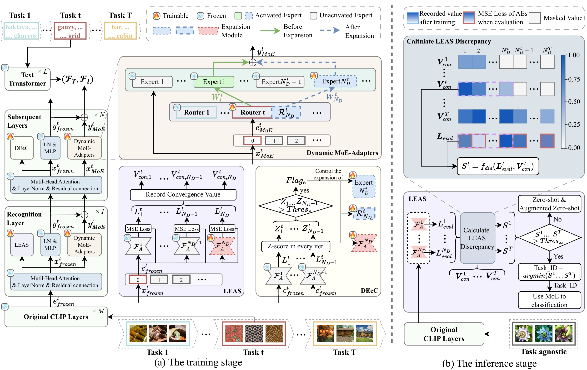

# MoE-Adapters++
Code for paper "[**MoE-Adapters++: Towards More Efficient and Flexible Continual Learning Approaches for Vision-Language Models**](https://ieeexplore.ieee.org/document/11122658)"

## Table of Contents
- [MoE-Adapters++](#moe-adapters)
  - [Table of Contents](#table-of-contents)
  - [Abstract](#abstract)
  - [Approach](#approach)
  - [Install](#install)
  - [Data preparation](#data-preparation)
  - [Model ckpt](#model-ckpt)
  - [MTCL](#mtcl)
    - [Train \& Test stage](#train--test-stage)
  - [Class Incremental Learning](#class-incremental-learning)
    - [Train stage](#train-stage)
  - [Citation](#citation)
  - [Acknowledgement](#acknowledgement)

## Abstract
In this paper, we first propose MoE-Adapters, a parameter-efficient training framework to alleviate long-term forgetting issues in incremental learning with Vision-Language Models (VLM). Our MoE-Adapters leverages incrementally added routers to activate and integrate exclusive expert adapters from a pre-defined static expert set, enabling the pre-trained CLIP to efficiently adapt to new tasks. To preserve the zero-shot capability of VLM, a Distribution Discriminative Auto-Selector (DDAS) is introduced that automatically routes in-distribution and out-of-distribution inputs to the MoE-Adapters and the original CLIP, respectively. However, relying on a static expert set and a separate distribution selector can lead to parameter redundancy and increased training complexity. In response, we further extend an MoE-Adapters++ framework by introducing dynamic MoE-adapters, which allows experts to be adaptively involved during the continual learning process. Additionally, a Latent Embedding Auto-Selector (LEAS) is proposed that incorporates distribution selection within CLIP to create a more unified architecture. Extensive experiments across diverse settings demonstrate that the proposed method consistently surpasses previous state-of-the-art approaches while concurrently improving training efficiency.
## Approach
___


## Install
This repository uses the same implementation as MoE-Adapters4CL
```bash
conda create -n MoE_Adapters4CL python=3.9
conda activate MoE_Adapters4CL
conda install pytorch==2.1.0 torchvision==0.16.0 torchaudio==2.1.0 pytorch-cuda=11.8 -c pytorch -c nvidia
cd cil
pip install -r requirements.txt
```

## Data preparation
This repository uses the same implementation as MoE-Adapters4CL
Target Datasets: Aircraft, Caltech101,CIFAR10, CIFAR100, DTD, EuroSAT, Flowers, Food, MNIST, OxfordPet,StanfordCars, SUN397

More details can refer to [datasets.md](mtil%2Fdatasets.md) of [ZSCL](https://github.com/Thunderbeee/ZSCL). Big thanks to them for their awesome work!

For DomainNet Datasets: Clipart, Infograph, Painting, Quickdraw, Real, Sketch. Please visit [DomainNet](https://ai.bu.edu/DomainNet/), we use the cleaned version.

## Model ckpt
All Models is avaliable in [Huggingface](https://huggingface.co/collections/HZCDLUT/moe-adapters-68b6b3b88fbbfbd83986f0b4)

## MTCL
We have consolidated the training and testing scripts for each experimental setup into a single script.
### Train & Test stage
Example:
1. Move the checkpoints to MoE-Adapters++/ckpt
2. ```cd MoE-Adapters4++/mtil```
3. Run the script ```bash scripts/vitB_TIL/train_full_shot_1000iters_order1.sh -> result.txt```
4. You can see the logs and results in ```result.txt```

## Class Incremental Learning
This repository uses the same implementation as MoE-Adapters4CL

### Train stage
This repository uses the same implementation as MoE-Adapters4CL

## Citation
```
@InProceedings{yu2024boosting,
  title={Boosting Continual Learning of Vision-Language Models via Mixture-of-Experts Adapters},
  author={Yu, Jiazuo and Zhuge, Yunzhi and Zhang, Lu and Hu, Ping and Wang, Dong and Lu, Huchuan and He, You},
  booktitle = {Proceedings of the IEEE/CVF Conference on Computer Vision and Pattern Recognition (CVPR)},
  year={2024}
}

@ARTICLE{11122658,
  author={Yu, Jiazuo and Huang, Zichen and Zhuge, Yunzhi and Zhang, Lu and Hu, Ping and Wang, Dong and Lu, Huchuan and He, You},
  journal={IEEE Transactions on Pattern Analysis and Machine Intelligence}, 
  title={MoE-Adapters++: Towards More Efficient Continual Learning of Vision-Language Models via Dynamic Mixture-of-Experts Adapters}, 
  year={2025},
  keywords={Continuing education;Training;Adaptation models;Computational modeling;Collaboration;Accuracy;Incremental learning;Magnetic heads;Natural language processing;Computational efficiency},
  doi={10.1109/TPAMI.2025.3597942}}

```

## Acknowledgement
Our repo is built on [wise-ft](https://github.com/mlfoundations/wise-ft), [Continual-CLIP](https://github.com/vgthengane/Continual-CLIP/tree/master) and [ZSCL](https://github.com/Thunderbeee/ZSCL). We thank the authors for sharing their codes.
